<a href="https://abdulmunaf.netlify.app/">
  
</a>

<p align="center">
  <a href="https://abdulmunaf.netlify.app/"></a>
  <a href="https://linkedin.com/in/abdul-munaf-z-6380a8251"></a>
  <a href="mailto:z.abdulmunaf@gmail.com"></a>
  
  
</p>

<br/>

### `01` &nbsp;About

I build front-ends that feel fast and ML systems that run in real time — object detection, emotion recognition, terrain segmentation, sign-language translation. Currently shipping **AI-powered full-stack web apps** while finishing a Master's in Computer Technology.

```yaml
based_in   : Coimbatore, Tamil Nadu
studying   : M.Sc. Computer Technology — Sri Krishna Arts & Science College
previously : B.Sc. AI & Machine Learning — Rathinam College
works_with : React · TypeScript · Python · PyTorch · OpenCV
talk_to_me : front-end architecture, computer vision, hackathon builds
speaks     : English · Tamil · Hindi · Urdu
```

<br/>

### `02` &nbsp;Hackathons

| Result | Event | Where | Year |
|:--|:--|:--|:-:|
| **1st Place** | HACKSTRONAUTS 24-hr Challenge — Exadata Club | SRM University, Chennai | 2025 |
| **1st Prize** | Mealzy — Innovative Food Web Solutions | AIC Raise, Coimbatore | 2025 |
| **2nd Prize** | New India Vibrant Hackathon — Urban Governance | Surat Municipal Corporation | 2023 |
| **3rd Prize** | Indian Sign Language Detection System | Sri Krishna College of Engineering | 2026 |
| **Top 8** | Bitathon — SAS Analytics Model Pitch | Goa Institute of Management | 2026 |

<br/>

### `03` &nbsp;Selected work

| Project | What it does | Built with |
|:--|:--|:--|
| [**Full-Stack Chat + Sentiment AI**](https://full-stack-chatting-website.onrender.com) | Real-time chat with image sharing and live sentiment analysis, stored in MongoDB Atlas | React · Node · MongoDB · NLP |
| [**GreenSight AI**](https://github.com/ABDULMUNAFZ/Duality-AI-Offroad-Semantic-Segmentation-Challenge) | Classifies off-road terrain into 10 environmental classes in real time | Python · YOLOv8 · PyTorch |
| [**Indian Sign Language Recognition**](https://github.com/ABDULMUNAFZ/Indian-Sign-Language-Recognition-System) | Continuous sentence formation with multi-language text-to-speech | OpenCV · PyTorch |
| **Bakery brand site** <sub>freelance</sub> | Pixel-perfect marketing site for a bakery brand | React · Webflow |
| **Counseling & healing services** <sub>freelance</sub> | Calm, accessible landing page for a therapy practice | React · Node · Flask |

<br/>

### `04` &nbsp;Stack

| | |
|:--|:--|
| **Front-end** |        |
| **Back-end & cloud** |       |
| **AI / ML** |      |
| **Tools** |       |

<br/>

### `05` &nbsp;Activity

<picture>
  <source media="(prefers-color-scheme: dark)" srcset="https://raw.githubusercontent.com/ABDULMUNAFZ/ABDULMUNAFZ/output/calendar-3d-dark.svg" />
  <source media="(prefers-color-scheme: light)" srcset="https://raw.githubusercontent.com/ABDULMUNAFZ/ABDULMUNAFZ/output/calendar-3d-light.svg" />
  
</picture>

<p align="center">
  
  
</p>

<picture>
  <source media="(prefers-color-scheme: dark)" srcset="https://raw.githubusercontent.com/ABDULMUNAFZ/ABDULMUNAFZ/output/snake-dark.svg" />
  <source media="(prefers-color-scheme: light)" srcset="https://raw.githubusercontent.com/ABDULMUNAFZ/ABDULMUNAFZ/output/snake.svg" />
  
</picture>

<br/>

### `06` &nbsp;Certifications

      

<br/>

<p align="center"><sub>3D calendar and snake regenerate every 12 hours from <a href="./scripts/iso-calendar.mjs"><code>scripts/iso-calendar.mjs</code></a> and <a href="https://github.com/Platane/snk">Platane/snk</a>.</sub></p>
